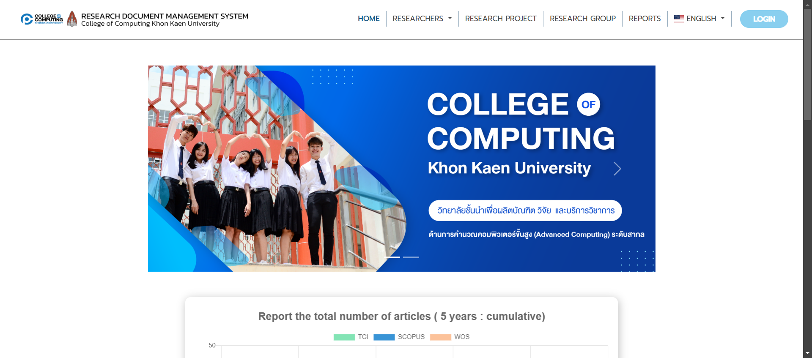
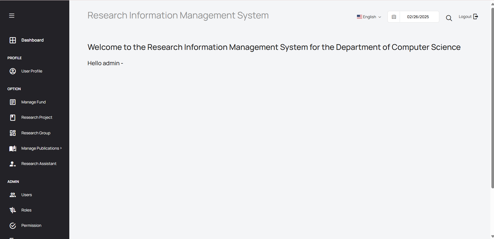
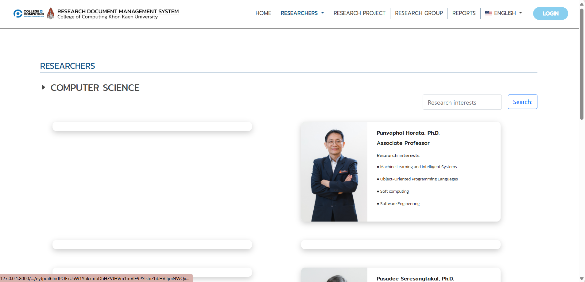
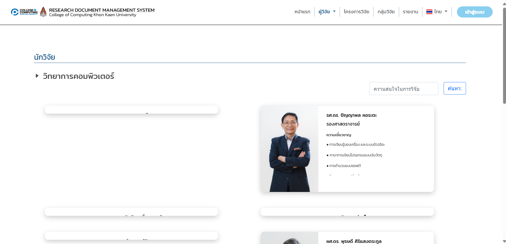
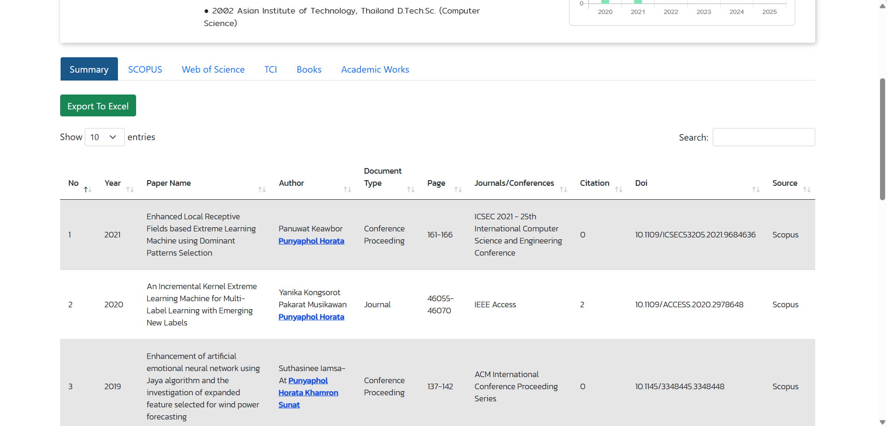
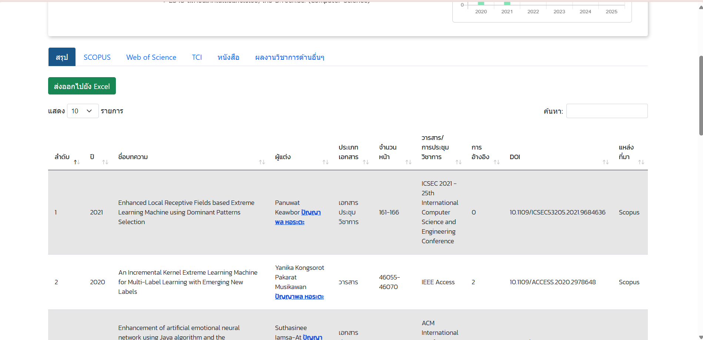
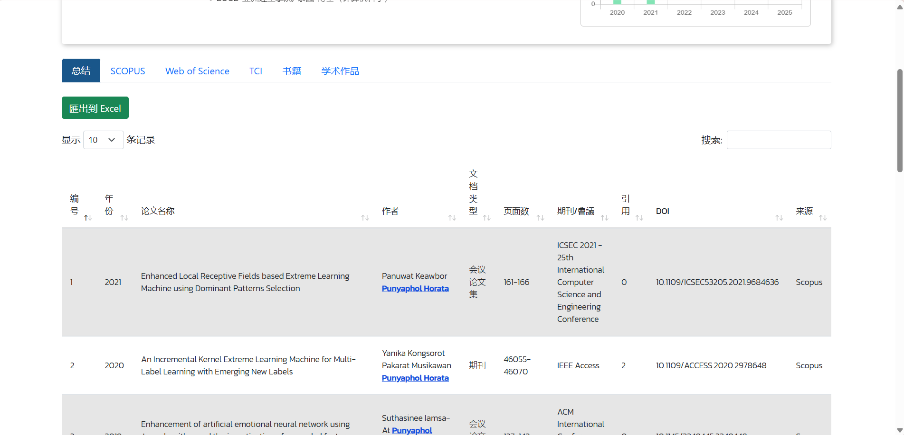

# คู่มือการใช้งาน User Manual
 
## การเข้าถึงเว็บไซต์

### ขั้นตอนที่ 1: เปิดเบราว์เซอร์ของคุณ
เปิดเว็บเบราว์เซอร์ที่คุณต้องการใช้ (Google Chrome, Firefox, Microsoft Edge ฯลฯ)

### ขั้นตอนที่ 2: ป้อน URL ของเว็บไซต์
ไปที่เว็บไซต์โดยพิมพ์ URL ต่อไปนี้ลงในแถบที่อยู่:
[https://cs6sec267.cpkkuhost.com/](https://cs6sec267.cpkkuhost.com/)

### ขั้นตอนที่ 3: สำรวจหน้าแรก
เมื่อเข้าสู่หน้าแรก คุณจะพบเมนูหลักและฟังก์ชันที่ใช้งานได้

---

## การเข้าสู่ระบบ

### ขั้นตอนที่ 1: คลิกปุ่ม "LOGIN"
มองไปที่มุมขวาบนของหน้าเว็บและคลิกที่ **LOGIN**

### ขั้นตอนที่ 2: กรอกข้อมูลเข้าสู่ระบบ
ป้อน **ชื่อผู้ใช้** และ **รหัสผ่าน** จากนั้นกด **LOG IN**

### ขั้นตอนที่ 3: เข้าสู่เมนูกลุ่มวิจัย
ค้นหาและคลิกที่ **Research Group** ในเมนูด้านข้าง

---

# สามารถแปลส่วนของหน้าบ้าน

### หน้า Researchers

### หน้า Home

### หน้า Research Project
(images/project.png)

### หน้า Research Group
(images/group.png)
 เมื่อกดปุ่ม more details
 (images/group-detail.png)
### หน้า Report

(images/report.png)

---

## ส่วนของ User

### User เมื่อเข้าสู่ระบบจะไปหน้า Dashboard โดยรูปภาพจะเรียงตาม User Profile, Manage Fund, Research Group, Publication research, Book, ผลงานวิชาการอื่นๆ เรียงตามลำดับ

(images/dashboard-u.png)
(images/user-u.png)
(images/fund-u.png)
(images/group-u.png)
(images/project-u.png)
(images/paper-u.png)
(images/book-u.png)
(images/work.png)

## ส่วนของ Admin

### Admin เมื่อเข้าสู่ระบบจะไปหน้า Dashboard และมีส่วนต่างๆ เหมือนดัง User แต่จะมีส่วนที่แอดมินสามารถแก้ไขได้แก่ Users, Roles, Permission, Departments, Manage Programs, Manage Expertise เรียงตามลำดับ

(images/dashboard-a.png)
(images/user-a.png)
(images/role-a.png)
(images/permission-a.png)
(images/department-a.png)
(images/program-a.png)
(images/expertise-a.png)
(images/work.png)