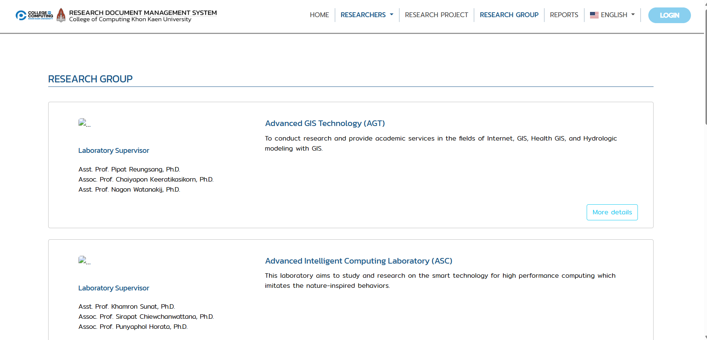
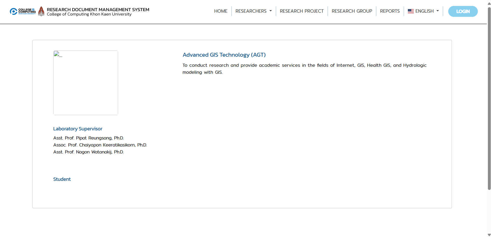
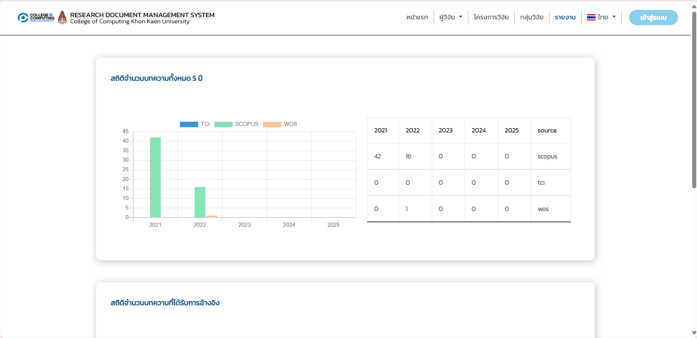
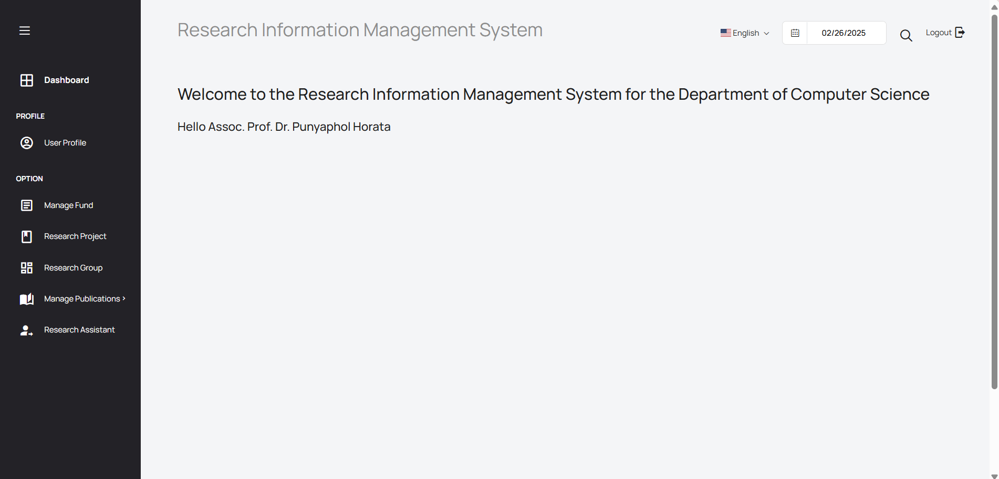
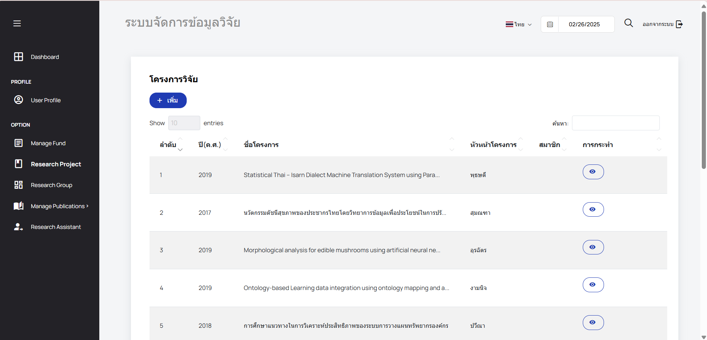
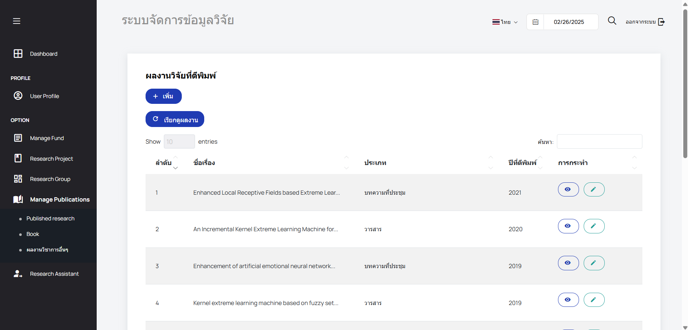
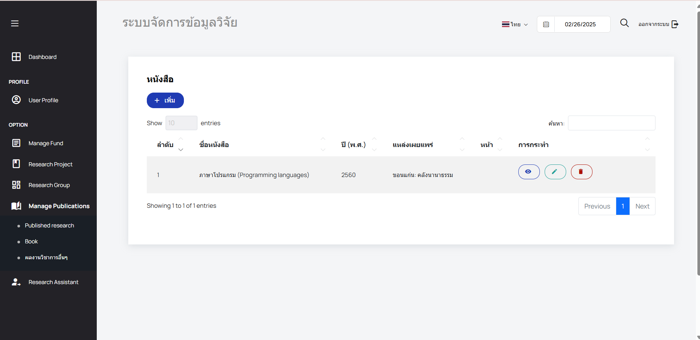
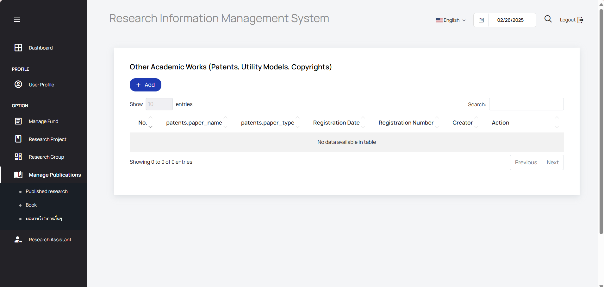
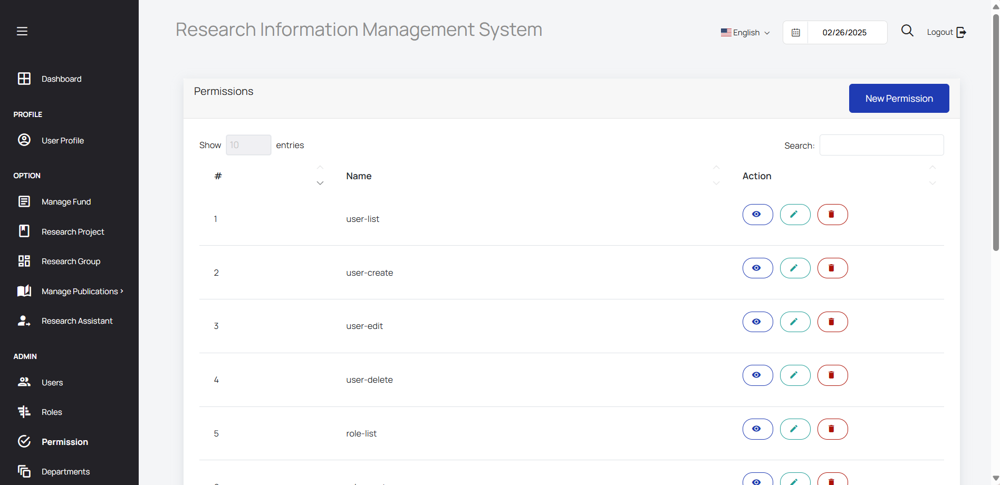
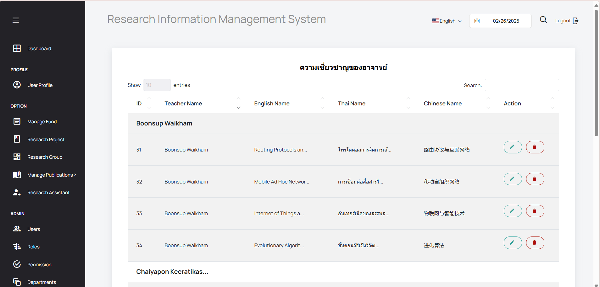

# คู่มือการใช้งาน User Manual
 
## การเข้าถึงเว็บไซต์

### ขั้นตอนที่ 1: เปิดเบราว์เซอร์ของคุณ
เปิดเว็บเบราว์เซอร์ที่คุณต้องการใช้ (Google Chrome, Firefox, Microsoft Edge ฯลฯ)

### ขั้นตอนที่ 2: ป้อน URL ของเว็บไซต์
ไปที่เว็บไซต์โดยพิมพ์ URL ต่อไปนี้ลงในแถบที่อยู่:
[https://cs6sec267.cpkkuhost.com/](https://cs6sec267.cpkkuhost.com/)

### ขั้นตอนที่ 3: สำรวจหน้าแรก
เมื่อเข้าสู่หน้าแรก คุณจะพบเมนูหลักและฟังก์ชันที่ใช้งานได้

---

## การเข้าสู่ระบบ

### ขั้นตอนที่ 1: คลิกปุ่ม "LOGIN"
มองไปที่มุมขวาบนของหน้าเว็บและคลิกที่ **LOGIN**

### ขั้นตอนที่ 2: กรอกข้อมูลเข้าสู่ระบบ
ป้อน **ชื่อผู้ใช้** และ **รหัสผ่าน** จากนั้นกด **LOG IN**

### ขั้นตอนที่ 3: เข้าสู่เมนูกลุ่มวิจัย
ค้นหาและคลิกที่ **Research Group** ในเมนูด้านข้าง

---

# สามารถแปลส่วนของหน้าบ้าน

### หน้า Researchers

### หน้า Home

### หน้า Research Project
(images/project.png)

### หน้า Research Group

 เมื่อกดปุ่ม more details

### หน้า Report

---

## ส่วนของ User

### User เมื่อเข้าสู่ระบบจะไปหน้า Dashboard โดยรูปภาพจะเรียงตาม User Profile, Manage Fund, Research Group, Publication research, Book, ผลงานวิชาการอื่นๆ เรียงตามลำดับ

## ส่วนของ Admin

### Admin เมื่อเข้าสู่ระบบจะไปหน้า Dashboard และมีส่วนต่างๆ เหมือนดัง User แต่จะมีส่วนที่แอดมินสามารถแก้ไขได้แก่ Users, Roles, Permission, Departments, Manage Programs, Manage Expertise เรียงตามลำดับ

