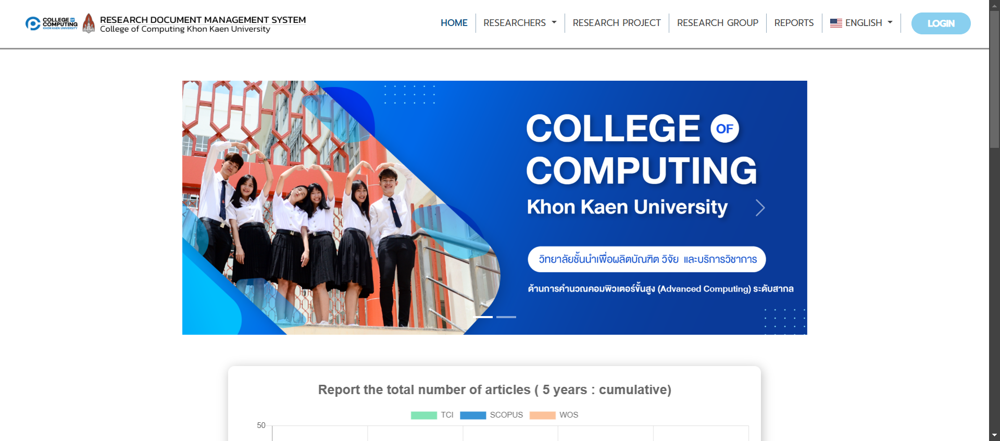
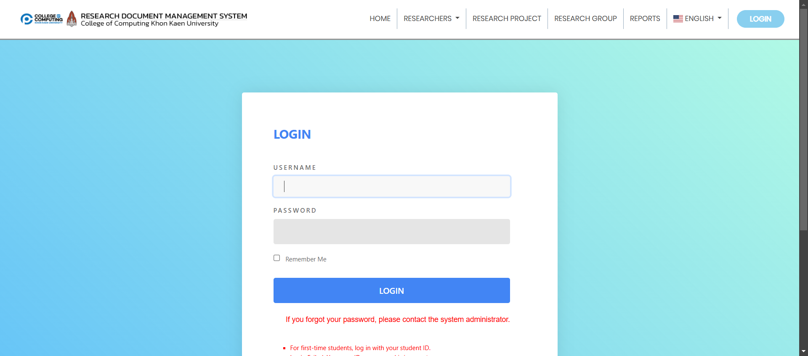

# คู่มือการใช้งาน User Manual
 
## การเข้าถึงเว็บไซต์

### ขั้นตอนที่ 1: เปิดเบราว์เซอร์ของคุณ
เปิดเว็บเบราว์เซอร์ที่คุณต้องการใช้ (Google Chrome, Firefox, Microsoft Edge ฯลฯ)

### ขั้นตอนที่ 2: ป้อน URL ของเว็บไซต์
ไปที่เว็บไซต์โดยพิมพ์ URL ต่อไปนี้ลงในแถบที่อยู่:
[https://cs6sec267.cpkkuhost.com/](https://cs6sec267.cpkkuhost.com/)

### ขั้นตอนที่ 3: สำรวจหน้าแรก
เมื่อเข้าสู่หน้าแรก คุณจะพบเมนูหลักและฟังก์ชันที่ใช้งานได้

---

## การเข้าสู่ระบบ

### ขั้นตอนที่ 1: คลิกปุ่ม "LOGIN"
มองไปที่มุมขวาบนของหน้าเว็บและคลิกที่ **LOGIN**

### ขั้นตอนที่ 2: กรอกข้อมูลเข้าสู่ระบบ
ป้อน **ชื่อผู้ใช้** และ **รหัสผ่าน** จากนั้นกด **LOG IN**

---

### การแปลภาษา
#### คุณสามารถแปลภาษาได้ โดยการเลือก Dropdown ด้านบนฝั่งซ้ายมือ

- เลือกภาษา

- จะพบว่าสามารถเปลี่ยนภาษาได้

 
 

---

## ส่วนของ User

### User เมื่อเข้าสู่ระบบจะไปหน้า Dashboard โดยรูปภาพจะเรียงตาม User Profile, Manage Fund, Research Group, Publication research, Book, ผลงานวิชาการอื่นๆ เรียงตามลำดับ

#### หน้านี้คือหน้าแรกที่จะมาถึงเมื่อเข้าสู่ระบบ

#### หน้า User จะเป็นหน้าข้อมูลส่วนตัวของผู้ใช้สามารถที่จะแก้ไข อัปเดตได้

#### หน้า Manage Fund เป็นหน้าที่ผู้ใช้งานจะพบกับกองทุนวิจัยที่ตนเองมีส่วนร่วม

#### หน้า Manage Group เป็นหน้าที่ผู้ใช้งานจะพบกับกลุ่มวิจัยที่ตนเองมีส่วนร่วม

#### หน้า Manage Project เป็นหน้าที่ผู้ใช้งานจะพบกับโครงการวิจัยที่ตนเองเป็นสมาชิก

#### หน้า Publication research แสดงผลงานทางวิชาการพร้อมทั้งข้อมูลต่างๆของผู้ใช้งาน

#### หน้า Book แสดงผลงานหนังสือของผู้ใช้งาน

#### หน้า other academic works จะแสดงผลงานอื่นๆ ของผู้ใช้งาน เช่น ลิขสิทธิ์ สิทธบัตร

## ส่วนของ Admin

### Admin เมื่อเข้าสู่ระบบจะไปหน้า Dashboard และมีส่วนต่างๆ เหมือนดัง User แต่จะมีส่วนที่แอดมินสามารถแก้ไขได้แก่ Users, Roles, Permission, Departments, Manage Programs, Manage Expertise เรียงตามลำดับ

#### หน้า Dashboad เป็นหน้าแรกที่จะแสดงเมื่อแอดมิน login เข้ามา

#### หน้า Users แอดมินมีสิทธิสามารถ ดู  อัปเดต ลบ เพิ่ม ข้อมูลของผู้ใช้ในระบบได้ทุกคน

#### หน้า role ใช้เพื่อ เพิ่ม ลบ แก้ไข บทบาทของผู้ใช้งานในระบบ

#### หน้า Permission ใช้เพื่อให้สามารถกำหนดสิทธิต่างๆ ของผู้ใช้งานในระบบ

#### หน้าใช้แสดง และแก้ไขภาควิชา

#### หน้า programs จะสามารถเพิ่ม ลบ แก้ไข ข้อมูลของหลักสูตรได้

#### หน้า expertise สามารถ แก้ไข และ ดู ความเชี่ยวชาญของนักวิจัยในวิทยาลัยการคอมพิวเตอร์ได้
